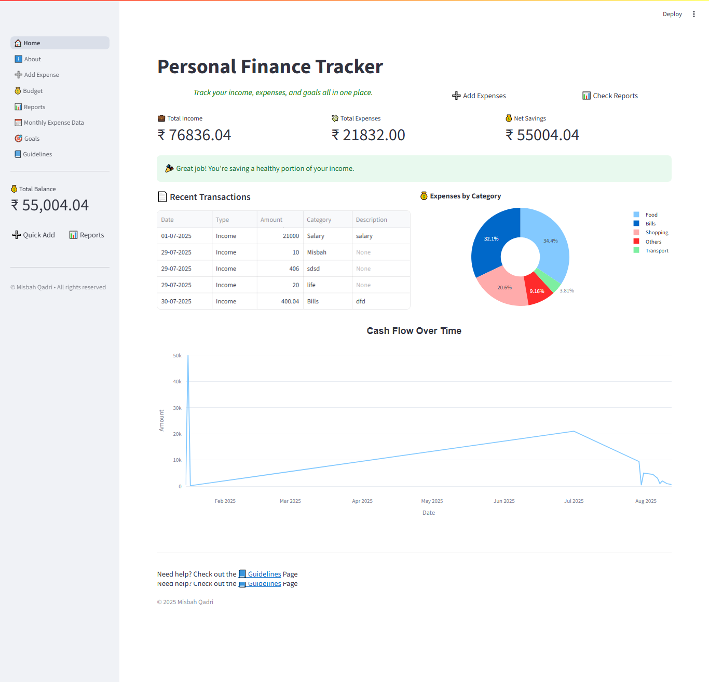
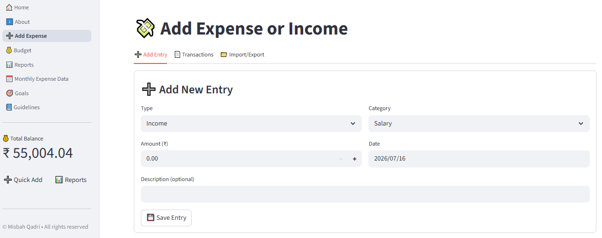
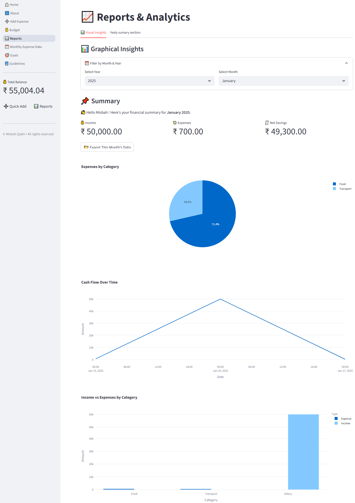
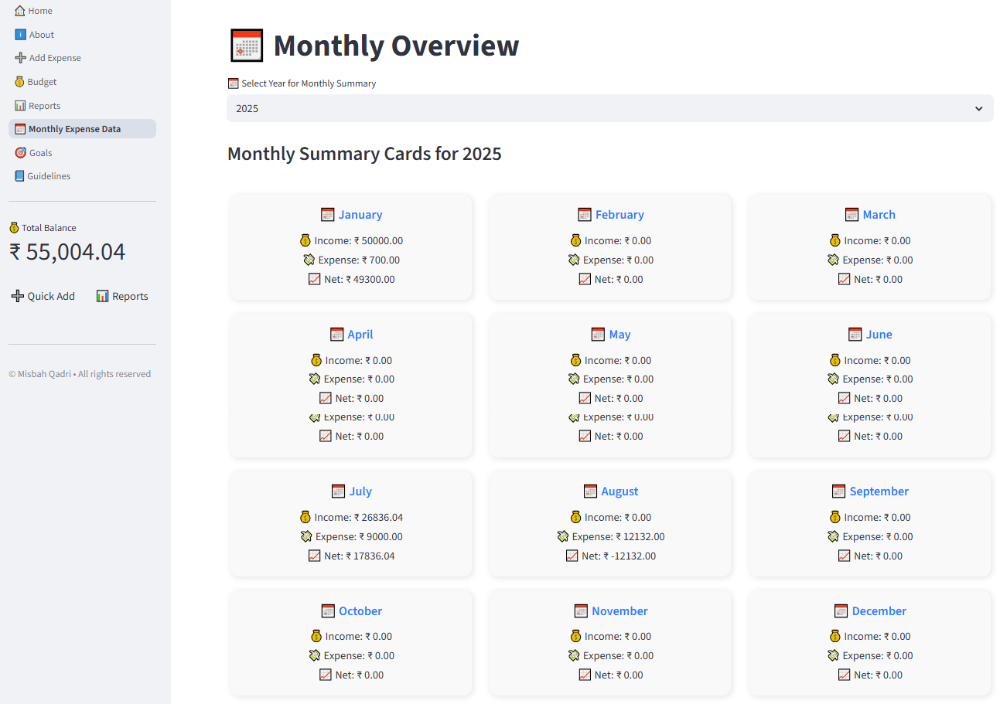
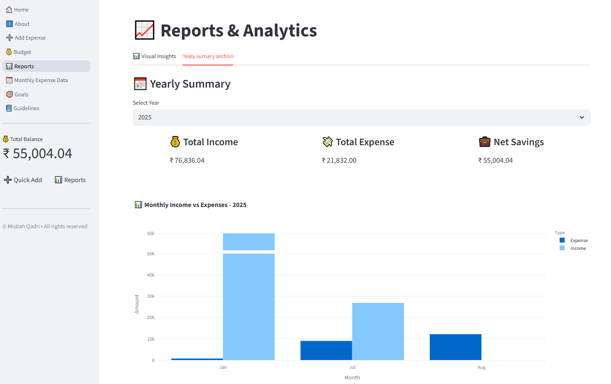

# 💸 Personal Finance Tracker

A personal finance management application built using **Python, Streamlit, Pandas, and Plotly**. This project helps users manage their daily income and expenses, set budgets, track savings goals, and understand their financial habits through interactive dashboards.

---

## 📷 Project Preview

### 🏠 Home Dashboard


### ➕ Add Transaction


### 📊 Reports & Analytics


### 📅 Monthly Overview


### 📈 Yearly Summary


### 💳 Budget Overview


### 🎯 Financial Goals


---

## ✨ Features

- Track daily income and expenses
- Add, edit, and delete transactions
- View monthly and yearly financial summaries
- Set monthly budgets and monitor spending
- Create and track financial goals
- Interactive charts and spending insights
- Import and export data using CSV
- Generate PDF reports
- Automatic data backup
- Simple, clean, and responsive user interface

---

## 🛠️ Tech Stack

- Python
- Streamlit
- Pandas
- NumPy
- Plotly
- FPDF
- CSV

---

## 📂 Project Structure

```text
Personal-Finance-Tracker/
│
├── main.py
├── home.py
├── add_expense.py
├── report.py
├── monthly.py
├── budget.py
├── goal.py
├── about.py
├── guidelines.py
├── config.py
├── utils.py
├── data_cleanup.py
├── data/
├── backups/
├── screenshots/
├── requirements.txt
└── README.md
```

---

## 🚀 Getting Started

### Clone the repository

```bash
git clone <repository-url>
```

### Go to the project folder

```bash
cd Personal-Finance-Tracker
```

### Install the required packages

```bash
pip install -r requirements.txt
```

### Run the application

```bash
streamlit run main.py
```

---

## 📌 How to Use

1. Add your income and expense transactions.
2. Set monthly budgets for different categories.
3. View reports and charts to understand your spending.
4. Track your savings goals.
5. Export your data or generate reports whenever needed.

---

## 📚 What I Learned

This project helped me improve my skills in:

- Python programming
- Data analysis with Pandas
- Building interactive web applications using Streamlit
- Data visualization with Plotly
- Working with CSV files
- Creating reusable and modular Python code
- Designing a clean and user-friendly interface

---

## 🚀 Future Improvements

- User login and authentication
- Database integration (SQLite/MySQL)
- Cloud data backup
- Email reports
- AI-powered spending insights

---

## 👨‍💻 Developed By

**Misbah Qadri**

If you like this project, feel free to ⭐ the repository.

---
**Thank you for visiting my project!**
